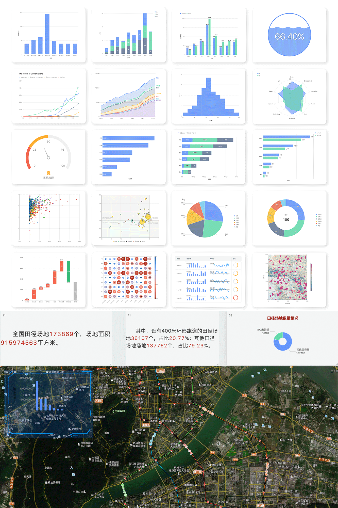
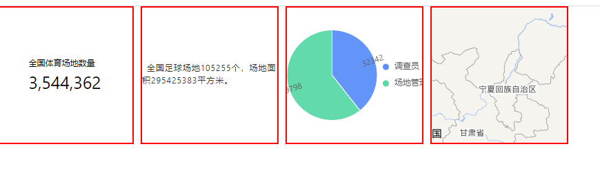

<h1 align="center">Gde</h1>

<div align="center>

自定义封装Geoc、G2、G2Plot、L7、Mapbox等自定义图表配置


</div>

<div align="center">
  
</div>


## 安装

### npm

```bash
$ yarn add gde
```

### clone

```bash
$ git clone https://github.com/geocompass/geoc-chart.git

$ cd geoc-chart/

$ npm run build

$ lib/gde.min.js
```


## 使用
<div align="center">
    
</div>

<br/>

```html
<div id="gde-geoc_text"></div>

<div id="gde-geoc_multilinetext"></div>

<div id="gde-g2plot_pie"></div>

<div id="gde-mapbox"></div>
```

```js
import Gde from 'gde';

Gde.accessToken = '';
new Gde('gde-geoc_text', '4c2d467e-fc82-4ca1-bc73-fec59242c330');
new Gde('gde-geoc_multilinetext', 'b8adc5bf-d86b-4810-86b3-f0792c369bea');
new Gde('gde-g2plot_pie', 'c0190da6-e803-48a8-9266-32f7e44a5690');
new Gde('gde-mapbox', '65eec7ab-64e7-4922-97cb-c9962233b967');
```


## 参数 

属性 | 类型 | 必填 | 说明 | 示例
---------|----------|---------|---------|---------
accessToken | String | 是 | 内部服务请求参数`token` | 'xxx-xxx-xxx'
container | String | 是 | 图表渲染容器`container` | 'gde-geoc_text'
chartId | String | 是 | 内部服务请求参数`chartId` | '4c2d467e-fc82-4ca1-bc73-fec59242c330'


## Tips

- 服务权限`accessToken`。
- 通过服务`/datavisual/dashbord_info`请求图表`chartId`列表。
- [Packet size](https://github.com/geocompass/geoc-chart/blob/main/package.json#L27)


## 测试

### `geoc-chart`包中

```bash
$ npm run build

$ npm link
```

### 使用该包的项目中

```bash
$ npm link gde
```


## 数据文档

<details>
  <summary><b>G2Plot 使用文档</b></summary>

  [G2Plot](https://g2plot.antv.vision/zh/docs/manual/introduction)
</details>

<details>
  <summary><b>Mapbox 使用文档</b></summary>

  [Mapbox](https://docs.mapbox.com/mapbox-gl-js/api/)
</details>

<details>
  <summary><b>Geoc 使用文档</b></summary>

  [Geoc](https://github.com/geocompass/geoc-chart/blob/main/doc/GEOC.md)
</details>


## 许可证

MIT
